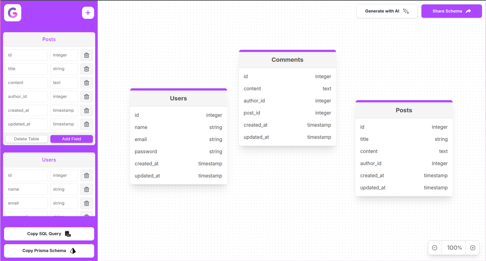

# GenTable - AI Powered Database Visual Schema Designer

GenTable is an AI-powered database visual schema designer that allows you to create, edit, and manage database schemas visually. This tool provides an intuitive interface to design your database schema with ease.



## Features

- **Visual Schema Design**: Drag and drop tables and fields to design your database schema visually.
- **AI-Powered**: Generate database schemas using AI.
- **Real-Time Updates**: Changes are reflected in real-time.
- **Export Options**: Export your schema as SQL or Prisma schema.
- **Responsive Design**: Works seamlessly on different screen sizes.

## Getting Started

### Prerequisites

- Node.js
- npm

### Installation

1. Clone the repository:
   ```bash
   git clone https://github.com/marvelxcodes/gentable.git
   cd gentable
   ```

2. Install dependencies:
   ```bash
   npm install
   ```

3. Start the development server:
   ```bash
   npm run dev
   ```

4. Open your browser and navigate to `http://localhost:3000`.

## Usage

### Creating a Table

1. Click on the "Create Table" button in the sidebar.
2. A new table will be added to the canvas and the sidebar.
3. Edit the table name and fields as needed.

### Adding Fields

1. Click on the "Add Field" button in the table card in the sidebar.
2. A new field will be added to the table.
3. Edit the field name and value as needed.

### Exporting Schema

1. Click on the "Copy SQL Query" or "Copy Prisma Schema" button in the sidebar.
2. The schema will be copied to your clipboard.

## Development

### File Structure

- `public/`: Contains static assets and HTML files.
- `src/`: Contains the source code.
  - `scripts/`: Contains JavaScript files.
  - `styles/`: Contains CSS files.
- `dist/`: Contains the build output.

### Configuration

- `webpack.config.js`: Webpack configuration file.
- `tsconfig.json`: TypeScript configuration file.
- `tailwind.config.js`: Tailwind CSS configuration file.
- `.prettierrc`: Prettier configuration file.

## Contributing

Contributions are welcome! Please open an issue or submit a pull request.

## License

This project is licensed under the MIT License.
